[:it: IT](README-it.md "Italian")&nbsp;&nbsp;

# Trayslate

Trayslate is a tray-based client for translation services. You can enter text directly, translate clipboard content, or translate selected text in any application. You can also replace text in another app with its translation using a hotkey. The app lets you choose and fully configure the translation service you use.

  
  

## What is it?

A **compact tray translator** that is always at hand. It acts as a web client for translation services — meaning it doesn’t include any built-in engines, everything is handled through **external configurable services**. This keeps the tool **lightweight and independent**.

It works anywhere on your system. Select text in any application and translate it instantly using a **global hotkey** — not just in the browser. You can also replace text directly inside input fields with the translated version in a single keystroke. Double-click the tray icon to quickly translate your clipboard content.

For added convenience, the main window supports **real-time translation as you type**, allowing you to draft text and see the translation simultaneously.

The interface is available in **twenty-five widely used languages**, making it accessible to a global audience.

**Always close, always ready** — a translator that fits perfectly into your workflow.

---

## Features:

- **Always Available** — Runs in the system tray and is always ready  
- **External Services** — Uses configurable translation services with no built-in engines  
- **Configurability** — Fully configurable using INI files  
- **System-wide Use** — Works across all applications, not just the browser  
- **Global Hotkeys** — Translate selected text using configurable hotkeys  
- **Input Replacement** — Replace text directly inside input fields using a hotkey  
- **Clipboard Support** — Process clipboard content via tray icon double-click or hotkeys  
- **Popup Window** — Floating translation window with quick access from anywhere
- **Real-time Mode** — Live processing while typing with an adjustable delay  
- **Auto Language Swap** — Optional automatic swap based on the input language  
- **Smart Language Swap** — Automatically switches language pair if detected language is outside current pair  
- **Tray Indicator** — Shows the current language pair and translation progress on the tray icon  
- **Recent Pairs** — Manage and automatically save recently used language pairs  
- **Mouse Mode** — Translate text by simply selecting it with the mouse in any application  
- **Multilingual UI** — Interface available in twenty-five widely used languages  
- **Dark Mode** — Supports Windows dark mode and adapts to system theme  

## Tray Icon

The tray icon is fully customizable in appearance settings and adapts to any Windows color scheme. It also provides a context menu for quick access to features such as switching configurations, managing recent language pairs, and other key functions.

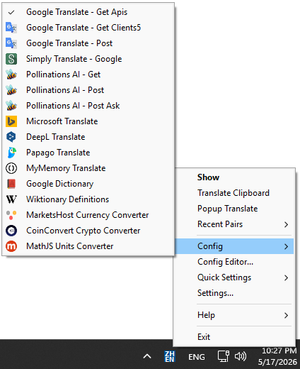

---

## Recent Language Pairs

A convenient panel for instantly switching between your most frequently used language pairs and configurations. Each entry can belong to a different config, making it easy to jump across workflows without extra setup.

The panel can be automatically populated based on your activity when auto-add is enabled in the settings, keeping your most relevant pairs always within reach. You can also add pairs manually at any time using the plus button on the panel or middle-click any pair to remove it from the panel.

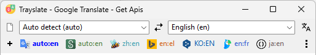

---

## Popup Window

Popup translation window supports text translation using configurable hotkeys. You can translate either text from the clipboard or selected text from any application. 

Drag-and-drop of text from other applications into the popup window is also supported 

> **Note:** Depending on Windows security restrictions, drag-and-drop may require both Trayslate and the source application to run with the same privileges.

The popup window can stay on top of other windows and supports adjustable transparency, with separate settings for both idle and hover states. It also allows configuring the visibility of interface elements, which can be shown only on hover or kept always visible. All these options are configurable in Settings.

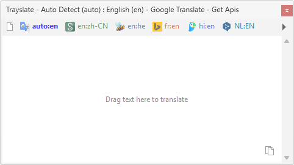

---

## Mouse Mode

Mouse Mode allows translating text by selecting it with the mouse in any application. After selecting text, a translation action becomes available depending on the selected mode.

By default, a Translate button appears after text selection. Clicking this button opens the translation result in a popup window if needed.

You can configure how translation is triggered after selection:

- Only When Ctrl Is Pressed — Mouse Mode is active only while holding the Ctrl key
- Show Translate Button — Displays a translation button after selecting text (default behavior)
- Show Balloon Translation — Shows translation in a tray balloon popup (system tray notification)
- Show Popup Translation — Opens a floating popup window with the translation result
- Show Main Window — Sends the selected text to the main application window for translation

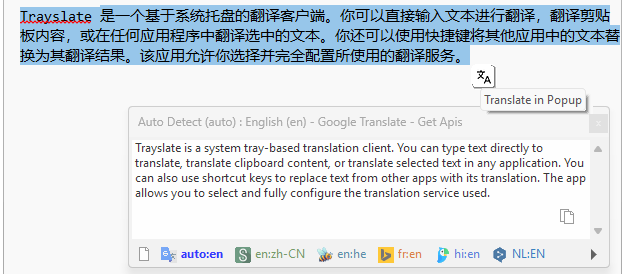

---

## Hotkeys

Global hotkeys can be fully configured in the application settings. They are available at any time and work even when the application is minimized to the system tray.

| Action | Shortcut |
|--------|----------|
| **Global Hotkeys** | |
| Shows or hides the main application window | `Ctrl + Shift + A` |
| Swaps the source and target languages | `Ctrl + Shift + S` |
| Translates the current text from the clipboard | `Ctrl + Shift + T` |
| Translates the current text in clipboard and copies the result to the clipboard | `Ctrl + Shift + R` |
| Translates clipboard text to a popup window near the mouse cursor | `Ctrl + Shift + P` |
| Translates the selected text from the active application | `Ctrl + Shift + C` |
| Replaces the selected text in the active application with the translation | `Ctrl + Shift + V` |
| Translates selected text from the active application to a popup window | `Ctrl + Shift + X` |
| **Recent Language Pair Hotkeys** | |
| Select recent language pair 1 | `Ctrl + Shift + 1` |
| Select recent language pair 2 | `Ctrl + Shift + 2` |
| Select recent language pair 3 | `Ctrl + Shift + 3` |
| Select recent language pair 4 | `Ctrl + Shift + 4` |
| Select recent language pair 5 | `Ctrl + Shift + 5` |
| Select recent language pair 6 | `Ctrl + Shift + 6` |
| Select recent language pair 7 | `Ctrl + Shift + 7` |
| Select recent language pair 8 | `Ctrl + Shift + 8` |
| Select recent language pair 9 | `Ctrl + Shift + 9` |
| **Main Window Hotkeys** | |
| New Translate | `Ctrl + N` |
| Add Current Pair To Recent Panel | `Ctrl + F` |
| Translate | `Ctrl + Enter` `Shift + Enter` `Double Enter`|

---

## Auto-Swap Languages

Automatically detects the input language using the selected language detection configuration and updates the translation pair accordingly.

When enabled, the application analyzes the source text language and automatically swaps the translation direction if the detected language does not match the current source language.

> **Note:** This feature does not work during Real-Time Translation mode, where the language pair remains fixed for continuous processing.

### Smart Language Swap

Automatically adjusts the translation direction based on the detected input language and the configured Primary/Secondary language pair.

If the detected language is outside the current Primary/Secondary pair:
- The detected language becomes the new Source language
- The Target language is set to Primary language

If the detected language matches the Primary language:
- The translation pair is restored to Primary → Secondary

### Preferred Primary/Secondary Behavior
When the detected language matches the configured Target language, the application restores the original Primary/Secondary pair instead of performing a standard swap.

This ensures consistent behavior and keeps the preferred language pair as the default translation direction.

---

## Settings

Settings allow you to configure the behavior, appearance, and global hotkeys of the application.

| General | Interface | Global Hotkeys |
|-------------|-------------|-------------|
| 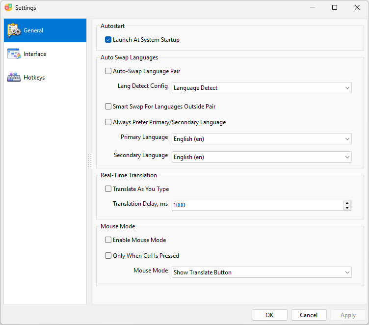 | 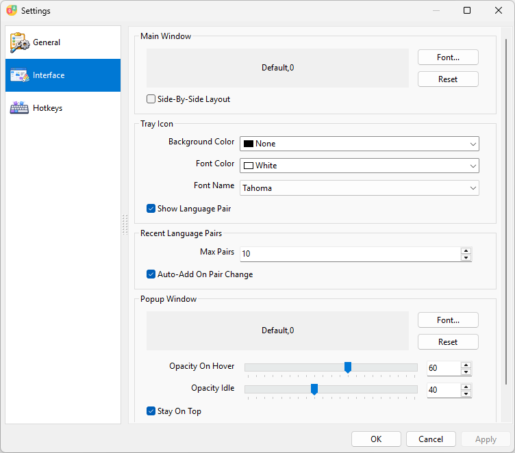 | 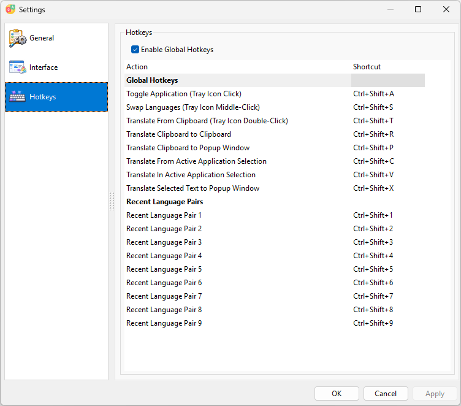 |

---

## Config

The application comes with a powerful configuration editor, allowing you to create your own translation service configurations or modify existing ones.

| Service | Parameters |
|---------|------------|
| 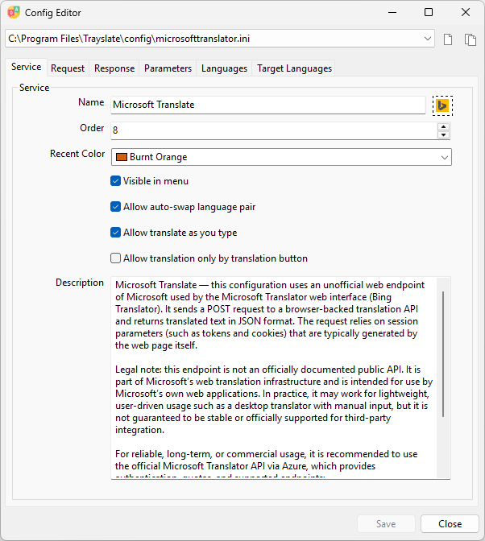 | 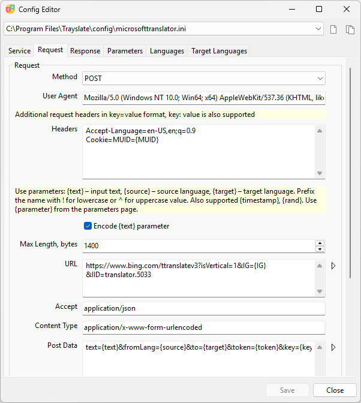 |
| **Response** | **Languages** |
| 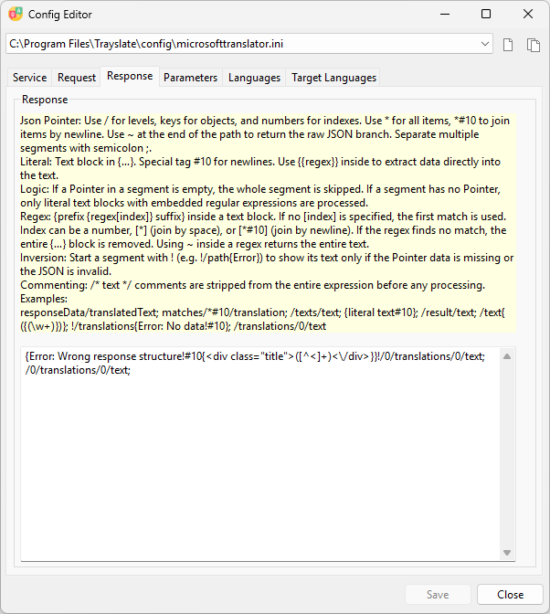 | 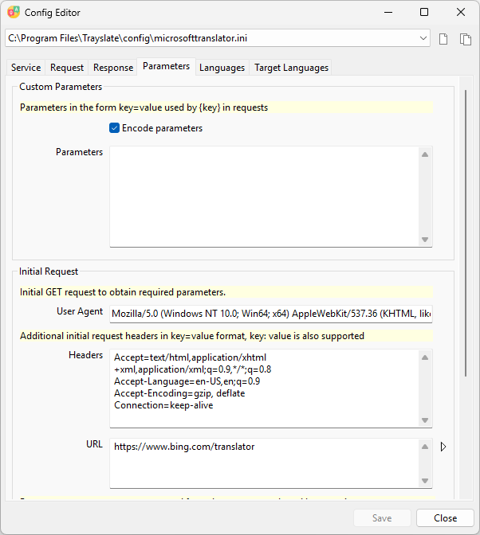 |
| **Target Languages** | |
| 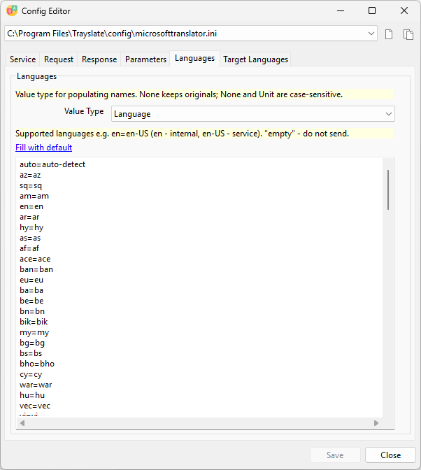 | 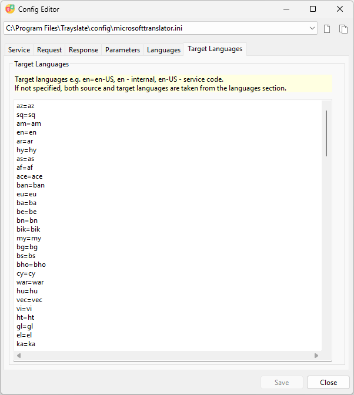 |

---

## Installation

### Windows

Several installer options are available on the releases page:

| Description | Files |
|-------------|-------|
| **Universal installer (EXE)** — universal installer for **x86 and x64**, supports installation **for the current user or for all users** | `trayslate‑any‑x86‑x64.exe` |
| **User installer (MSI)** — installs the application **for the current user** | `trayslate‑x64.msi` `trayslate‑x86.msi` |
| **System installer (MSI)** — installs the application **for all users on the system** | `trayslate‑x64‑allusers.msi` `trayslate‑x86‑allusers.msi` |
| **Portable version** — saves its settings to `form_settings.json` if it is near the executable; otherwise, in the user directory | `trayslate‑x86‑x64‑portable.zip` |

> **Note:** Windows XP supports installation **only via MSI installers**. The EXE installer is **not compatible** with Windows XP.

Download the installer from the [releases page](https://github.com/plaintool/trayslate/releases), run it, and follow the on-screen instructions. After installation, you can launch Trayslate from the Start menu or from the desktop shortcut.

---

## Donate 💖

If you like Trayslate and want to support its development, you can send a donation:

| Currency | Network | Wallet Address |
|----------|-----------------|----------------|
| USDT     | Tron (TRC20)    | `TYSJJHjpu6aqr8UsGaCTLxDyh6HKWoNQ8k` |
| USDT     | Ethereum (ERC20), Binance Smart Chain (BEP20) | `0x328e689E961c3Abb143835f8677947Fa9eaF9f6F` |
| BTC      | Bitcoin (BTC)   | `bc1qp8m5j75yd58zhf9hl0a753shay093j2548f84e` |
| ETH      | Ethereum (ERC20)| `0x328e689E961c3Abb143835f8677947Fa9eaF9f6F` |

Every little help is appreciated! 🙏

---

## Licensing

Trayslate is licensed under the GPL v3 license. See the LICENSE file for details.

The Trayslate application uses third-party resources licensed as described in the [THIRD_PARTIES](THIRD_PARTIES) file.

## Disclaimer

The application does not provide any translation services. It acts as a client for third-party services only. All usage of external services is the sole responsibility of the user, including compliance with their respective terms of service.

The configuration files included in the distribution are intended to demonstrate the flexibility of setting up and integrating custom translation services. Users may obtain and use API keys from service providers and configure the application to work with those services in accordance with the providers official guidelines and terms.
